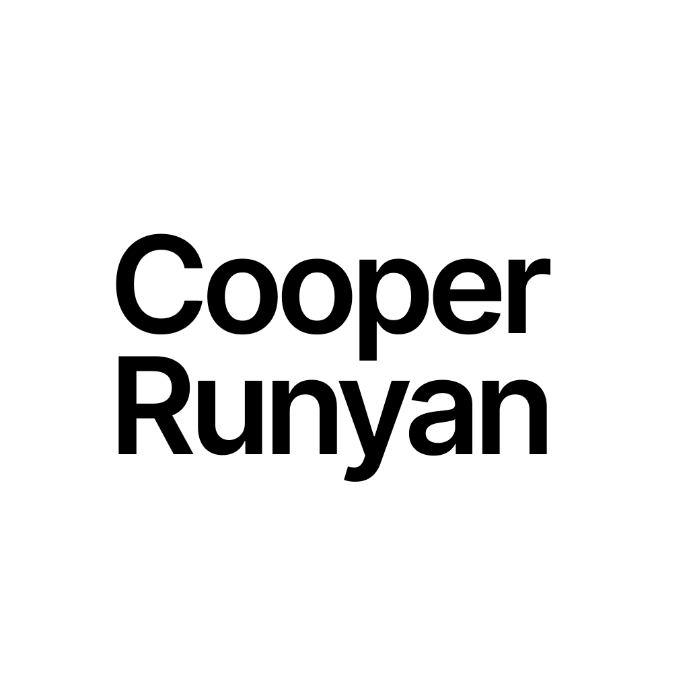

# Hello world, I'm Cooper

 &ensp; <a href="https://www.linkedin.com/in/cooper-runyan-52a343225/"> &ensp; <a href="https://codepen.io/cooperrunyan"> &ensp; <a href="https://stackoverflow.com/story/cooperrunyan"> &ensp; <a href="https://www.npmjs.com/~cooperrunyan"> &ensp; <a href="https://www.github.com/cooperrunyan">

 

- 🔭 I’m currently working on advancing my skillset
- 🌱 I’m currently learning React Native, Docker, Java and Arduido
- 💬 Ask me about my life!
- 📫 How to reach me: my email: `cooperrunyan@gmail.com` or my website `https://www.cooperrunyan.com`
- ⚡ Fun fact: I may be a web developer, but I'm very interested in Arduio

 

## Tech Stack

I work with tons of different languages, frameworks, libraries and technologies. Here are some of them:

&emsp; &emsp; &emsp; &emsp;

 
 

## Most used Languages

