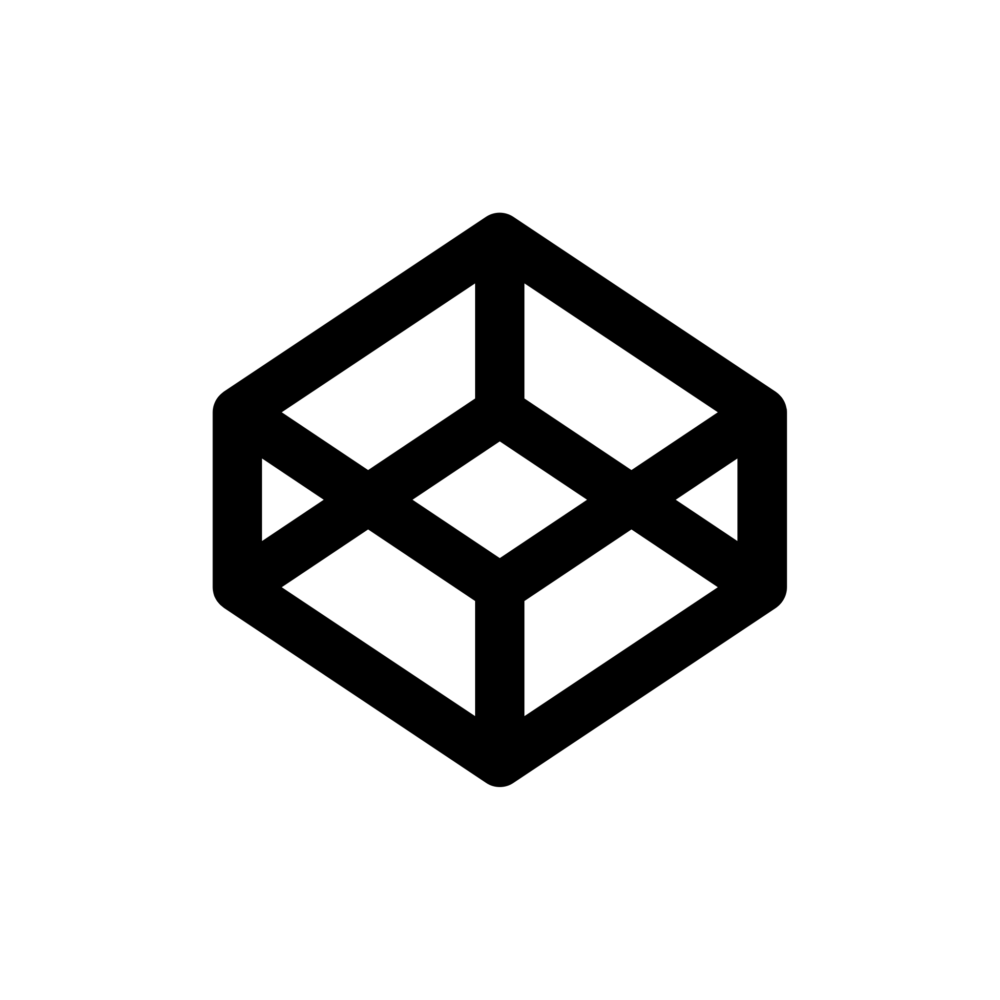
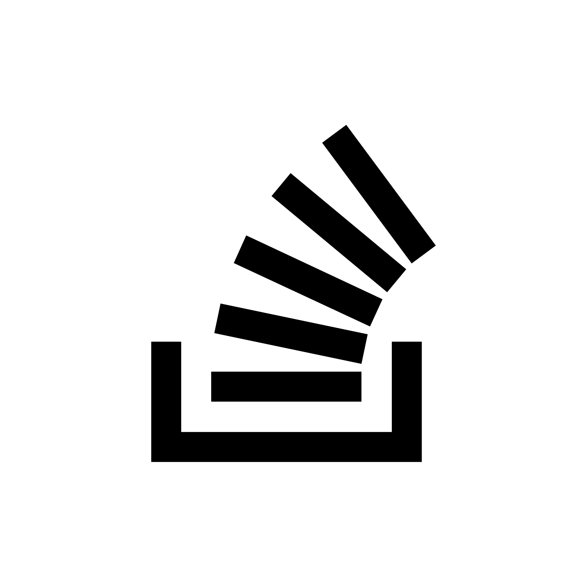
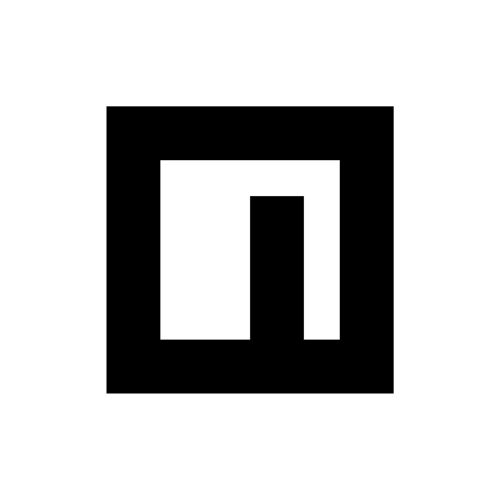
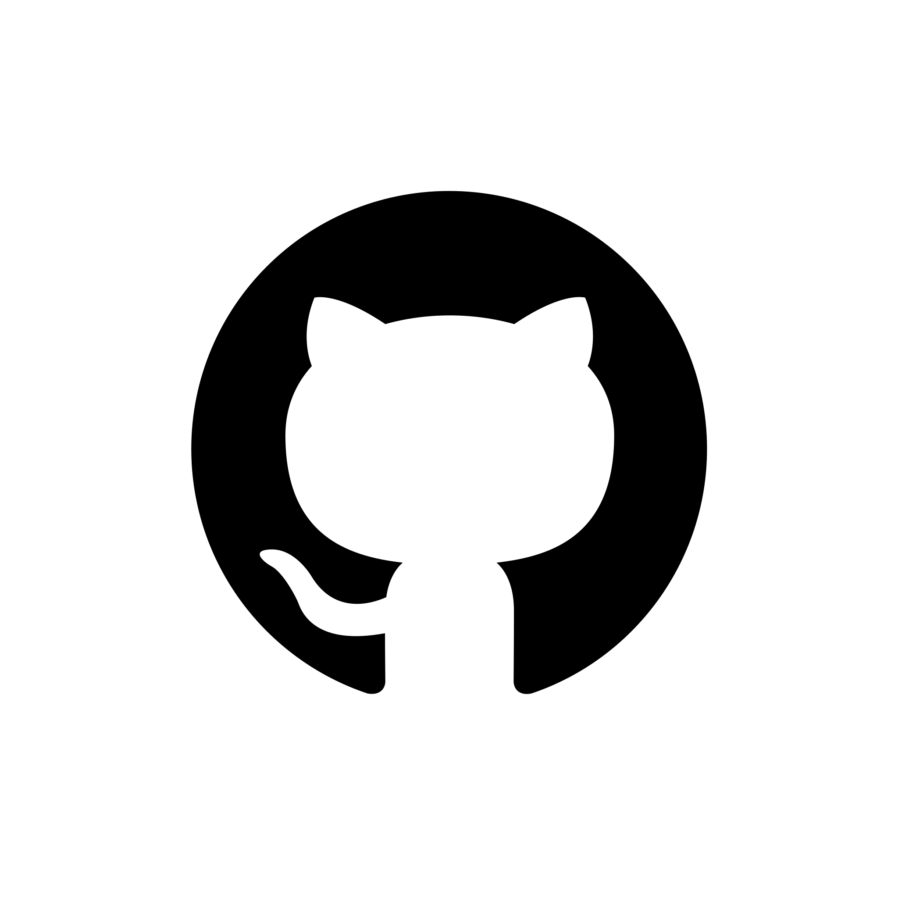
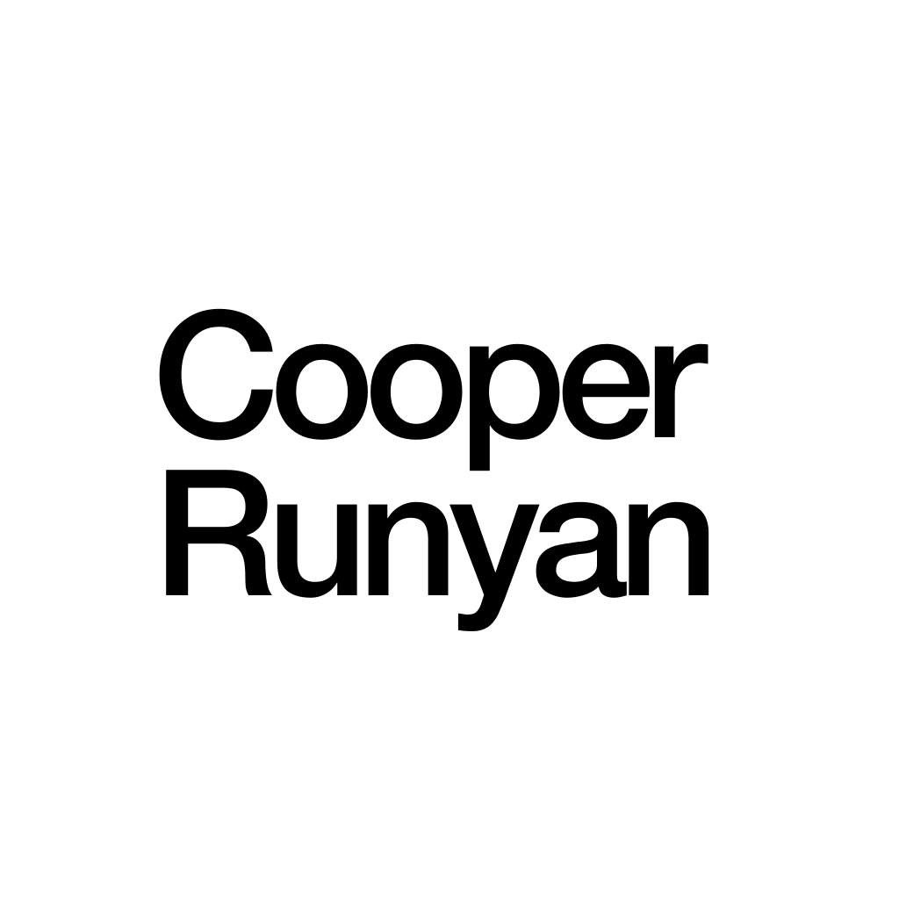

# Hello world, I'm Cooper

&ensp;
<a href="https://www.linkedin.com/in/cooper-runyan-52a343225/">
&ensp;
<a href="https://codepen.io/cooperrunyan">
&ensp;
<a href="https://stackoverflow.com/story/cooperrunyan">
&ensp;
<a href="https://www.npmjs.com/~cooperrunyan">
&ensp;
<a href="https://www.github.com/cooperrunyan">

 

## Tech Stack

I work with tons of different languages, frameworks, libraries and technologies.
Here are some of them:

&emsp;
&emsp;
&emsp;
&emsp;

 
 

## Most used Languages

<!--
**cooperrunyan/cooperrunyan** is a ✨ _special_ ✨ repository because its `README.md` (this file) appears on your GitHub profile.

Here are some ideas to get you started:

- 🔭 I’m currently working on ...
- 🌱 I’m currently learning ...
- 👯 I’m looking to collaborate on ...
- 🤔 I’m looking for help with ...
- 💬 Ask me about ...
- 📫 How to reach me: ...
- 😄 Pronouns: ...
- ⚡ Fun fact: ...
-->

